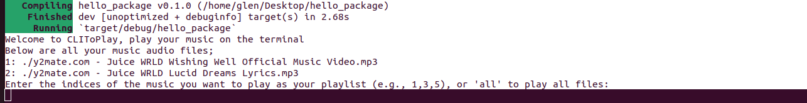
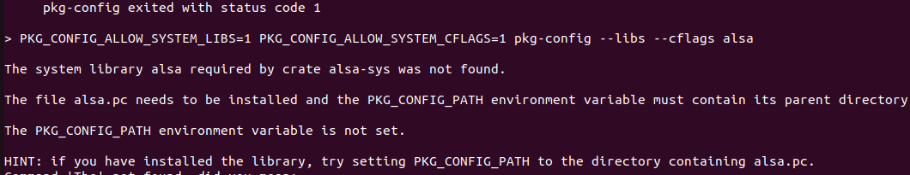

# CLIToPlay

- Play your music on the Terminal

the cli tool searches all you files and returns audio files then user selects desirable songs to play in that session just at ease right on the terminal

## procedure

- git clone
- cd clito_play
- cargo run

- if you get this  error bellow
        

- The error message encountered  is related to the pkg-config tool, which is used to retrieve compiler and linker flags for libraries. In this case, it's trying to find information about the ALSA (Advanced Linux Sound Architecture) library, but it's unable to locate the necessary .pc file.

- Here are a few steps you can try to resolve this issue:

 - Install the ALSA development package: The error suggests that the ALSA library itself is not installed on your system. You'll need to install the development package that provides the .pc file for pkg-config. On Ubuntu or Debian-based systems, you can try:

` sudo apt-get install libasound2-dev `

- On other distributions, the package name may vary (e.g., alsa-lib-devel on Fedora/CentOS).

## next after a succesful run

- select your disirable songs to play i.e 1,2,5,7 or type "all" to play all
- type `n` then enter to play the next song
- type `p` then enter to play the previous song
- type `q` then enter to quit the stream

## pros

- you get to play right on terminal as you code.
- simple to use
- memory usage is so slow
