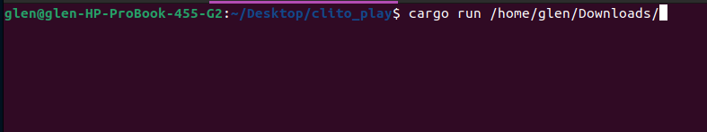
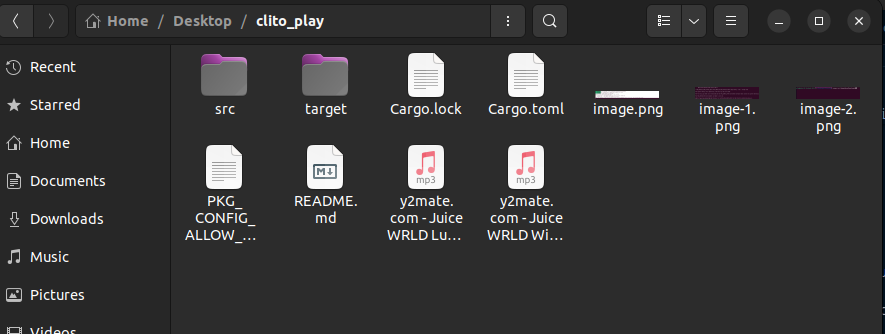

# CLIToPlay
Welcome to  CLIToPlay, Play your music on the Terminal

The cli tool searches all you files and returns audio files then user selects desirable songs to play in that session just at ease right on the terminal.

A powerful and user-friendly command-line interface (CLI) tool designed for any one ,Developers you gonna love it . 

Developed with Rust, this tool is not just a music player; it's a testament to the efficiency and versatility of the Rust programming language.

# Features

## Efficient Audio Playback

- **Direct Terminal Playback**: Play your favorite music tracks directly from the terminal, without the need for a separate GUI application.
- **File Scanning**: Automatically scans your system for audio files, making it easy to build a playlist from your entire music library.
- **Support for Various Audio Formats**: Plays a wide range of audio formats, ensuring compatibility with your music collection.
### Supported   Audio Formats
- WAV
- MP3
- FLAC
- OGG
- OPUS
- AAC
- M4A
- WMA
- ALAC

## User-Friendly Interface

- **Simple Commands**: Easy-to-use commands for play, pause, skip, and shuffle tracks, making it intuitive for both beginners and experienced users.
- **Playlist Management**: Create, edit, and manage playlists with ease, allowing for personalized listening experiences.
- **Volume Control**: Adjust the volume to your preference, ensuring a comfortable listening experience.

## Advantages of Using CLIToPlay

### Performance

- **Rust's Efficiency**: Developed in Rust, CLIToPlay Music Player benefits from the language's performance advantages. Rust is known for its speed, safety, and concurrency features, making it an excellent choice for building efficient applications.
- **Low Resource Usage**: Compared to GUI-based music players, CLIToPlay Music Player uses significantly less system resources, making it ideal for running on systems with limited resources.

### Portability

- **Cross-Platform**: CLIToPlay Music Player is designed to be cross-platform, allowing you to enjoy your music on Windows, macOS, and Linux without any compatibility issues.
- **Easy Installation**: With Rust's package manager, Cargo, installing CLIToPlay Music Player is straightforward and can be done with a single command.

### Customization and Control

- **Custom Commands**: Extend the functionality of CLIToPlay Music Player with custom commands, allowing for a highly personalized experience.

# How to get started

- git clone
- cd clito_play
## Running
-there are two ways to run the program.

1. Run this  command in the terminal `cargo run  /directory/to/your music-section or any folder with audios` i.e .
 - If you what to search from your parent directory all the files i.e `cargo run  /home/`.the cli is able to scan upto all the files in your system ..But considering overhead and if  you have a large disk and low memory system it can be too expensive to expensive best way is by knowing the most actual path to your files.
2. For experiement  purpose `cd ` inside this project cli_to_play copy your songs to this folder this way i.e .

3. #### coming soon after  publish the cli . You can  use your os comand for in your terminal to move to the directory which you think may have audio files i.e `cd Music or cd Downloads `  then run the command `cargo run .` 

- if you get this  error bellow
        

- The error message encountered  is related to the pkg-config tool, which is used to retrieve compiler and linker flags for libraries. In this case, it's trying to find information about the ALSA (Advanced Linux Sound Architecture) library, but it's unable to locate the necessary .pc file.

- Here are a few steps you can try to resolve this issue:

 - Install the ALSA development package: The error suggests that the ALSA library itself is not installed on your system. You'll need to install the development package that provides the .pc file for pkg-config. On Ubuntu or Debian-based systems, you can try:

` sudo apt-get install libasound2-dev `

- On other distributions, the package name may vary (e.g., alsa-lib-devel on Fedora/CentOS).

## next after a succesful run

- select your disirable songs to play i.e 1,2,5,7 or type "all" to play all

- type `n` then enter to play the next song
- type `p` then enter to play the previous song
- type `q` then enter to quit the stream
- type `r` to repeat your playlist
- ##### Note:repeat the playlist  set to true by default us r to change
- type `help` to see available command
- type `v+ OR v- OR v` for volume control
- type` f+ OR f- Or F` to forward & rewind control

## pros

- you get to play right on terminal as you code.
- simple to use
- memory usage is so low and it perfoms so fast
